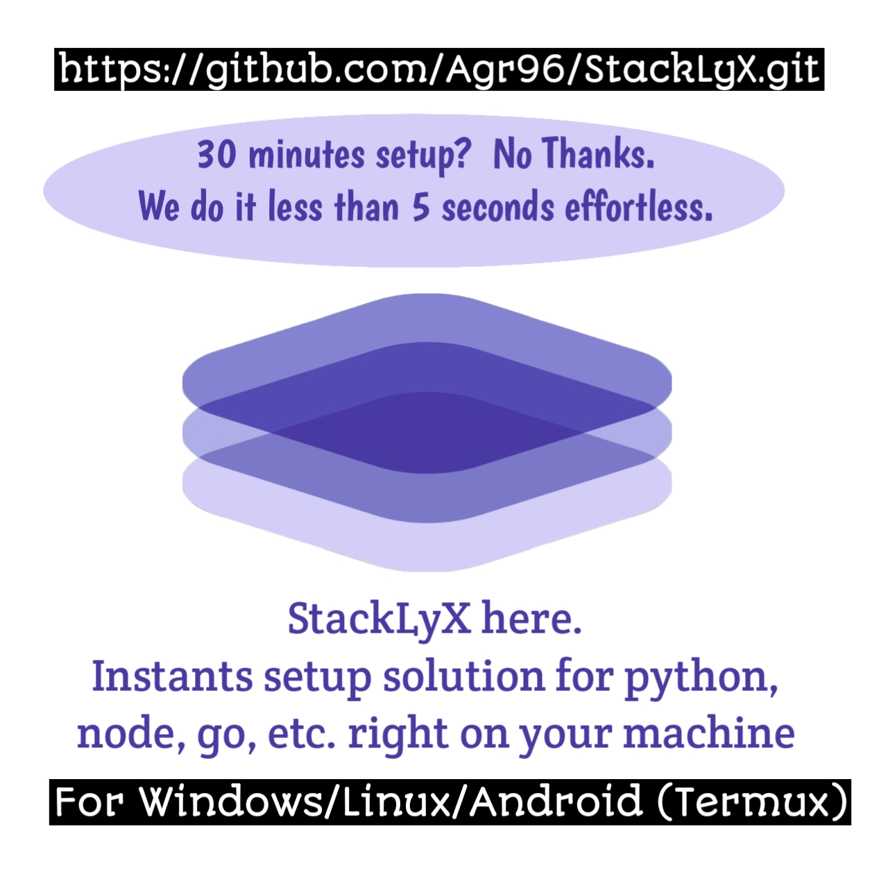

<p align="center">
  
</p>

<h1 align="center">🚀 StackLyX</h1>

<p align="center"><strong>30-minute setup? No thanks.</strong><br>
We run in less than 5 seconds — effortlessly.</p>

---

## 💡 What is StackLyX?

StackLyX is a modular runtime philosophy — for coders who value speed, clarity, and total control.  
Inspired by the pain of multi-language setups and logic chaos.  
Now simplified for every role, every project, in just a few seconds.

> **Deploy. Minimal resource. Done.**

---

## ⚙️ Key Features

- 🧱 Per-role language environments (Python, Go, Node, Rust…)
- 🧰 Auto-generated shell toolchain with version isolation
- 🧪 Testing & runtime instantly on CLI (no setup fatigue)
- 🔄 Safe updates with rollback system
- 🔌 Modular plugin & role system, commercial-ready
- 🔒 DMCA-aware licensing for your peace of mind

---

## 🛠️ Philosophy Power

> No more "build from scratch" frustration.  
> You code, StackLyX handles the rest.

- Inspired by real developer pain
- Designed for freedom, not locked containers
- Every update respects your local data

---

## 🧪 Quick Try

```bash
bash run_me.sh
```

Now you copy output path after execute run_me.sh

```bash
cd [paste here]
```

you see a file named give-me-name.sh, execute it

```bash
give-me-name.sh
```

choose the name you want for your project, example: lofi

Type
```bash
lofi
```
Then enter.

now start-[name].sh and stop-[name].sh is there

last step for enter the editor mode you execute the start-[name].sh

because in this example i gave name 'lofi' so it must be

```bash
start-lofi.sh
```

and voila you are ready to start your project, you are in a new virtual terminal,

This virtual terminal will remain even if you exit to the main terminal,

Question:
how to exit the virtual terminal for a while and then come back again?

```bash
tmux detach
```

Question:
How to get to virtual terminal? just execute start-[name].sh
```bash
start-[name].sh
```

virtual terminal will remain even if closing the main terminal, unless you run stop-[name].sh from the main terminal,

virtual terminal will remain even if closing the main terminal, 
